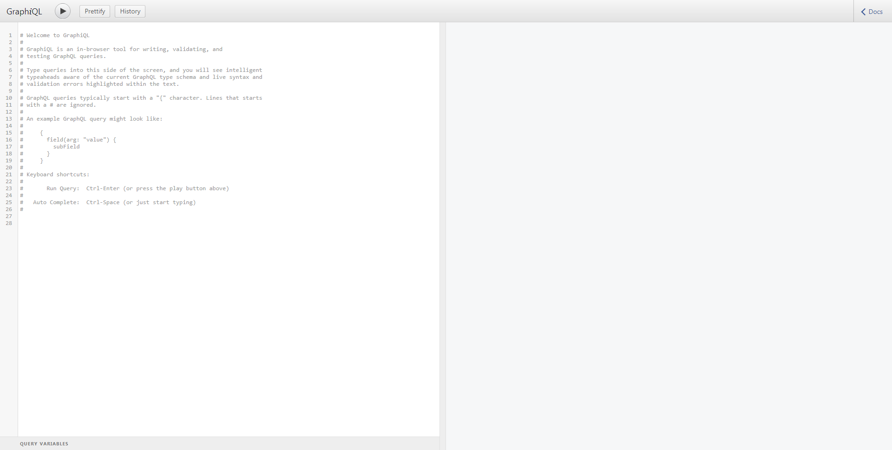

# Test Project for Back-end Engineer


## Requirements

For building and running the application you need:

- [JDK 1.8](http://www.oracle.com/technetwork/java/javase/downloads/jdk8-downloads-2133151.html)
- [Maven 3](https://maven.apache.org)

## Running the application locally

There are several ways to run a Spring Boot application on your local machine. One way is to execute the `main` method in the `com.mytest.pos.PosApplication` class from your IDE.

Alternatively you can use the [Spring Boot Maven plugin](https://docs.spring.io/spring-boot/docs/current/reference/html/build-tool-plugins-maven-plugin.html) like so:

```shell
$ mvn clean install
$ mvn spring-boot:run
```

## Libraries used
- Spring Boot
- Spring MVC (Spring Web)
- Spring Data JPA with Hibernate
- Spring for GraphQL
- MySql

## Configure MySQL
- Update the application.properties file in the `src/main/resources` folder with the URL, 'username' and 'password' for your MySQL instance. The table schema for the Sales objects will be created for you in the database.

## Description

To Test GraphQl query
go to [http://localhost:8080/graphiql](http://localhost:8080/graphiql) to start executing queries.



```
query { 
	recordNewSales(
	price: "200.00",
	price_modifier: 0.95,
	payment_method: "MASTERCARD",
	datetime: "2022-12-01T40:30:00Z"
	)
	{final_price, points}
}
```

```
query { 
	sales(startDateTime:"2022-11-08T00:00:00Z",endDateTime:"2022-11-08T23:00:00Z")
	{datetime,sales,point} 
}
```
